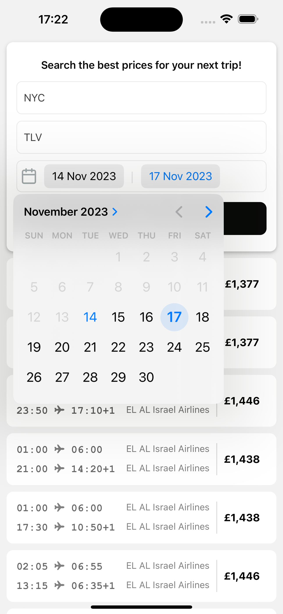

# Flight Price App

## Overview

Welcome to the Flight Price  App! This mobile application, built using Expo and TypeScript, empowers users to compare flight prices conveniently. By leveraging BrightData for web scraping from Skyscanner, the app gathers comprehensive information on flight deals, ensuring users access the best offers without spending countless hours searching.

## Features

1. **Web Scraping with BrightData:** This app utilizes BrightData to perform web scraping from Skyscanner, enabling it to gather real-time information on flight prices and deals.

2. **Data Fetching with React-Query:** We've implemented React-Query for efficient data fetching. This ensures a smooth user experience by seamlessly retrieving and updating flight information as needed.

## Getting Started

### Prerequisites

Before running the app, ensure you have the following:

- Node.js and npm installed
- Expo CLI installed (`npm install -g expo-cli`)

### Installation

1. Clone this repository:

   ```bash
   git clone https://github.com/IbrahimTahayneh/FligthPrices.git
2. Navigate to the project directory:

   ```bash
   cd flightpricesapp
3. Install dependencies:

   ```bash
   npm install
4. Start the Expo development server:

   ```bash
   expo start
5. Follow the Expo CLI instructions to run the app on your preferred platform (iOS or Android).

## Screenshots
 

